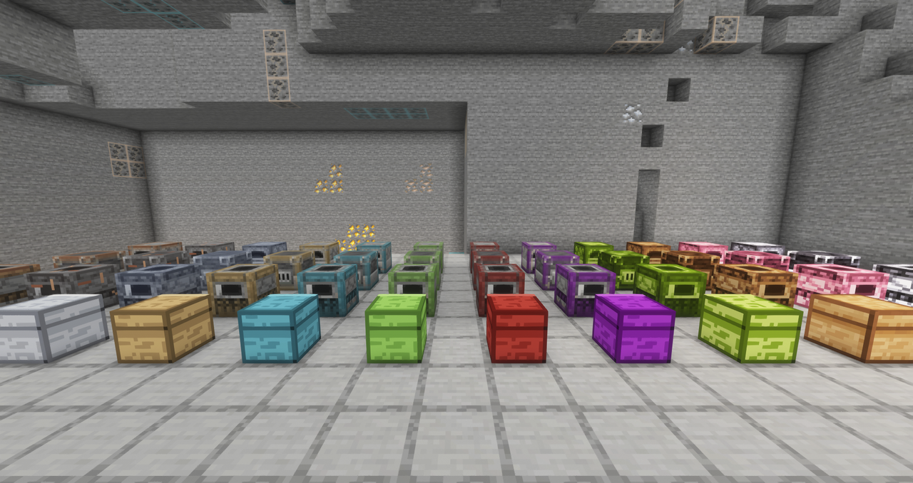
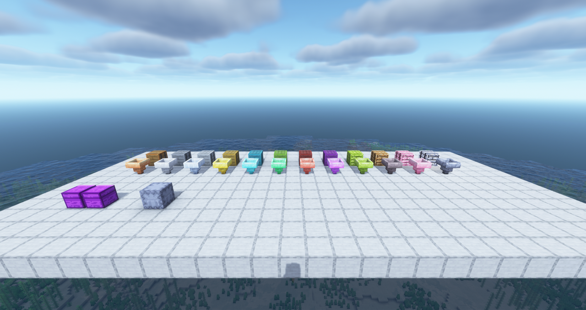
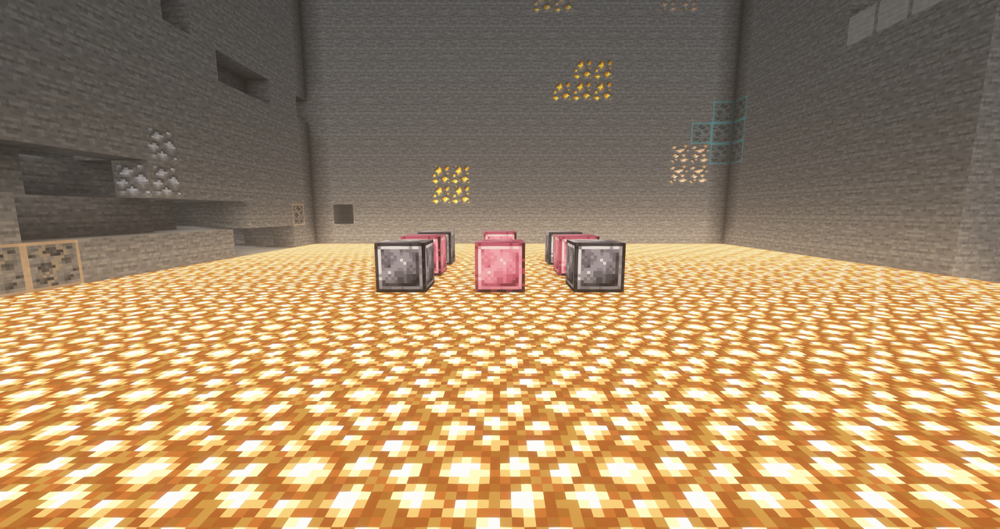
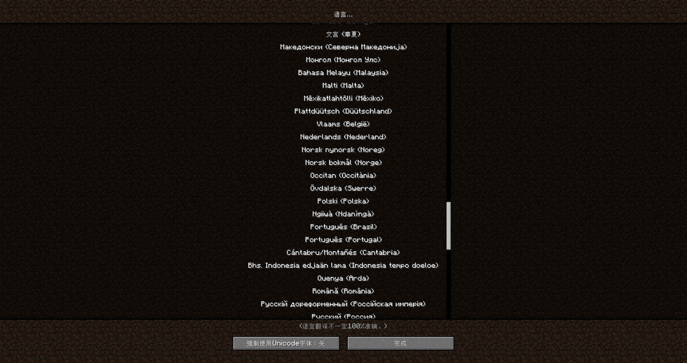

# [MBB] Austenium

Minecraft Forge 1.20.1 生存扩展模组：自铜至奥雷利亚尼姆共十二个升级档位，每档都有机器、储具、燃料与装备，另有奥氏挖矿维度。

[English](README.md) | **中文**

- **作者：** Suzuki Yumemi <szkymm@gmail.com>
- **共同作者：** Matt Belfast Brown (MBB) <thedayofthedo@gmail.com>
- **维护者：** Matt Belfast Brown (MBB)
- **许可证：** GPL-3.0-only

**当前版本：** 0.rc.2 为最新发布。

## 特性

- **十二档生产线。** 熔炉、高炉与烟熏炉自铜至奥雷利亚尼姆，燃料与产物同为原版 x1.25 至 x50 速。
- **可扩展的储具与物流。** 箱子与木桶最大 324 槽，十二档潜影盒链式升级且保留内容物，十二档漏斗每秒 3.3 至 100 件。
- **十六种煤炭。** 十二种档位煤加四种维度煤，十种煤矿分布于五种母岩，单块燃料值最高 8000 件。
- **奥氏挖矿维度。** 自 y -64 至 y 383 的分层挖矿维度，矿物压缩、自有生物，并用十二档存储方块搭门。
- **随档位成长的装备。** 每档都有工具与护甲；耀金与奥雷利亚尼姆自带固有附魔，奥雷利亚尼姆四件套免疫近战、弹射物与爆炸。
- **十三种语言与完整的信息模组支持。** 所有客户端文案皆可翻译，JEI、Jade 与 JER 在游戏内说明配方、机器、矿石与燃料。

  

## 支持语言

| 语系 | 语言 |
|---|---|
| 英语 | English (US) `en_us`、English (UK) `en_gb`、English (Australia) `en_au` |
| 中文 | 简体中文 `zh_cn`、繁體中文（香港）`zh_hk`、繁體中文（台灣）`zh_tw`、文言 `lzh` |
| 欧洲语言 | Français `fr_fr`、Español `es_es`、Italiano `it_it`、Русский `ru_ru` |
| 东亚语言 | 日本語 `ja_jp`、한국어 `ko_kr` |

## 安装

1. 安装 Minecraft 1.20.1 与 Forge 47 及以上（Java 17）。
2. 把发布版 jar 放进该配置的 `mods` 目录。
3. 可选：加入 JEI、Jade 或 JER，获得游戏内的配方与方块信息。

## 版本号与下载命名

功能版本为 `A.B.C`：正式版用 `MAJOR.MINOR.PATCH`，预发布用 `<Minor>.<stage>.<N>`，其中 stage 为 `alpha`、`beta` 或 `rc`。

同一个功能版本需要面向多个平台发布时，追加平台后缀，文件名写作 `A.B.C_D.E.F`：`D` 为 Minecraft 版本组，`E` 为该组内的加载器特性线，`F` 为该平台的出包序号。

当前平台为 `0L.5.0`：即 1.20 至 1.20.1 组、Forge 47.4 线、首次出包。只面向单一平台发布时，文件名保持纯 `A.B.C`。

## 链接

- [发布页](https://github.com/szkymm/Austenium/releases)
- [更新日志](docs/CHANGELOG.zh-cn.md)
- [问题反馈](https://github.com/szkymm/Austenium/issues)
- [内容指南](docs/content.zh-cn.md)
- [许可证](LICENSE)
