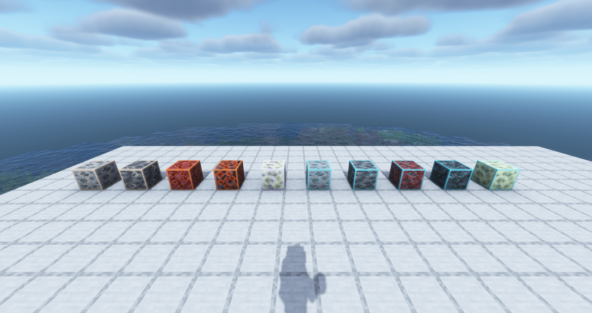
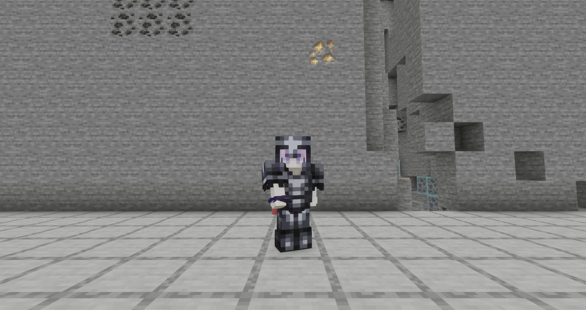
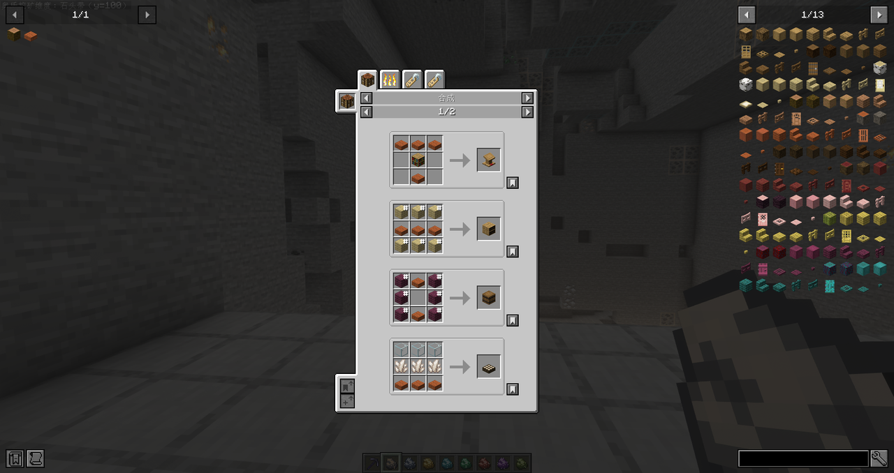
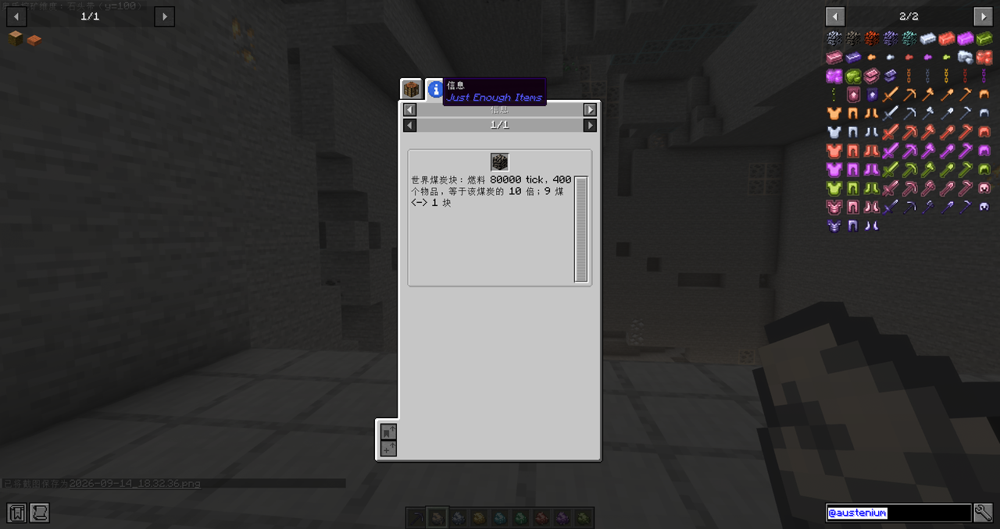

# [MBB] Austenium Content Guide

Everything the mod adds, in the order a player meets it. For installation and version naming see the [README](../README.md).

## First 30 Minutes

1. Play the vanilla opening: wood, a crafting table, stone tools and a vanilla furnace.
2. Mine copper and craft the copper tier: eight copper ingots in a ring around a vanilla furnace, chest or barrel gives the copper version of that piece.
3. Copper runs at x1.25 vanilla speed with 36 slots of storage, and every later tier is built the same way, so the first machine pays for itself quickly.
4. Silver is the first mod ore: it needs a stone pickaxe and appears between y -24 and y 56, plus a second band from y 80 to y 384.
5. Keep one of every machine and storage piece: the upgrade recipes consume the lower tier piece.

## Tier Progression

| Stage | Tiers | What it unlocks |
|---|---|---|
| Early | Copper, Iron, Silver, Gold | The base ladder: faster machines, larger storage, the first mod ore and the first chains. |
| Middle | Diamond, Emerald, Orichalcum, Mythril, Adamantite | Ore processing, deeper world generation, blast furnace and smoker alternatives on every tier. |
| Late | Netherite, Radiant, Aurelianium | Vanilla netherite materials, then the two smithed tiers with innate enchantments. |

Every tier covers machines, storage and gear. Machines run faster, storage grows, and the two smithed tiers add enchantments and set bonuses instead of raw numbers.

## Storage and Logistics

| Tier | Chest | Paired chest | Barrel | GUI |
|---|---|---|---|---|
| Copper | 9x4 = 36 | 9x8 = 72 | 36 | #F9801D |
| Iron | 10x4 = 40 | 10x8 = 80 | 40 | #9D9D97 |
| Silver | 9x5 = 45 | 9x10 = 90 | 45 | #F9FFFE |
| Gold | 12x4 = 48 | 12x8 = 96 | 48 | #FED83D |
| Diamond | 10x5 = 50 | 10x10 = 100 | 50 | #3AB3DA |
| Emerald | 12x5 = 60 | 12x10 = 120 | 60 | #80C71F |
| Orichalcum | 9x7 = 63 | 9x14 = 126 | 63 | #B02E26 |
| Mythril | 14x5 = 70 | 14x10 = 140 | 70 | #8932B8 |
| Adamantite | 15x5 = 75 | 15x10 = 150 | 75 | #5E7C16 |
| Netherite | 15x7 = 105 | 15x14 = 210 | 105 | #835432 |
| Radiant | 15x9 = 135 | 15x18 = 270 | 135 | #F38BAA |
| Aurelianium | 9x18 = 162 | 18x18 = 324 | 162 | #1D1D21 |

- Place two chests of the same tier side by side to pair them into the larger grid.
- Containers are mined with an axe; the copper tier has no tool requirement, iron to emerald need iron level, and orichalcum and above need diamond level.
- Twelve tier shulker boxes hold exactly the matching barrel capacity. The copper box takes any vanilla shulker box, each later tier takes the box below it, and both breaking and upgrading keep the contents.

| Tier | Rate | Cooldown | Batch |
|---|---|---|---|
| Copper | 3.3 items/s | 6 ticks | 1 |
| Iron | 5.0 items/s | 4 ticks | 1 |
| Silver | 6.7 items/s | 3 ticks | 1 |
| Gold | 8.0 items/s | 5 ticks | 2 |
| Diamond | 10 items/s | 2 ticks | 1 |
| Emerald | 12 items/s | 5 ticks | 3 |
| Orichalcum | 15 items/s | 4 ticks | 3 |
| Mythril | 20 items/s | 1 tick | 1 |
| Adamantite | 30 items/s | 2 ticks | 3 |
| Netherite | 40 items/s | 1 tick | 2 |
| Radiant | 60 items/s | 1 tick | 3 |
| Aurelianium | 100 items/s | 1 tick | 5 |

## Ores and Mining

| Ore | Mining level | Drops | Generation |
|---|---|---|---|
| Silver | Stone pickaxe | 1 to 2 raw silver, fortune and silk touch | Overworld y -24..56 and y 80..384, plus a rare large vein |
| Orichalcum | Diamond | 1 to 2 raw orichalcum, fortune and silk touch | Overworld twin peaks around y 35 and y -35, tails to 65 and -65 |
| Mythril | Diamond | 1 to 2 raw mythril, fortune and silk touch | Overworld twin bands y 5..45 and y -45..-5 |
| Adamantite | Diamond | 1 to 2 raw adamantite, fortune and silk touch | Overworld core y 5..25 with a rare tail to y 60, mirrored below zero |
| Radiant debris | Diamond | Itself, unaffected by fortune | Overworld y 8..64, mirrored block by block around y=0 |
| Hero debris | Diamond | Itself, unaffected by fortune | End, Gaussian band y 19..60, peak near y 39.5 |

- Silver, orichalcum, mythril and adamantite ore smelt or blast straight into the ingot, and the raw material does the same.
- Mining gates live in block properties and vanilla tags, so any tool of sufficient tier from any mod works.

## Coal and Fuel

- Sixteen coals: twelve tier coals from copper to aurelianium, and four dimension coals for the Overworld, the Nether, the End and the Austeniumcraft World.
- A tier coal burns 16 items times the machine multiplier of its tier, so copper coal covers 20 items and aurelianium coal covers 800.
- A dimension coal burns 5, 10, 15 or 20 vanilla coal blocks.
- A coal block is nine coals and burns exactly ten times its coal.
- One coal and one stick make eight torches, and every tier adds four more: copper coal gives 8, aurelianium coal 52, the Austeniumcraft coal 68.
- Ten coal ores sit on five host rocks: Overworld stone and deepslate, Nether netherrack and blackstone, End stone, and all four Austeniumcraft bands. Each drops one coal with fortune, keeps the block with silk touch, and accepts a wooden pickaxe.

## The Austeniumcraft World

- The dimension runs from y -64 to y 383 as a solid cake: bedrock at the bottom, then deepslate, stone, netherrack and end stone, with no water and no lava anywhere.
- Ores are compressed into each band, so a short mining trip covers all four rock types.
- Build the portal from the twelve tier storage blocks: a 5x5 ring without corners around a 3x3 plane of Austeniumcraft portal blocks, then left click the aurelianium block in the ring with any pickaxe.
- The portal links the Overworld and the dimension only, at 1:1 coordinates; an anchor above y 320 in the dimension returns to y 317 in the Overworld.
- Nether portals stay inert inside the dimension.

## Equipment and Enchantments

- Every tier has a full set of tools and armour, built from the tier material or smithed from the tier below.
- Radiant and aurelianium gear is smithed from the tier below with its upgrade template, and carries innate enchantments from the moment it is made: efficiency, fortune, unbreaking and mending on tools, protection and unbreaking on armour, feather falling on boots.
- Innate enchantments are never downgraded, and a Silk Touch book on an anvil replaces the innate Fortune at the same level.
- A full aurelianium set negates melee, projectile and explosion damage; fall, fire, magic, void and starvation still apply.

## Mod Integration

- JEI describes every machine, container, ore, coal and block in the game, in the client language.
- Jade shows tier, speed, hopper rate, slot count, fuel budget, mining tier and generation band on the block you look at.
- JER adds the world generation entries for the mod ores and coals.
